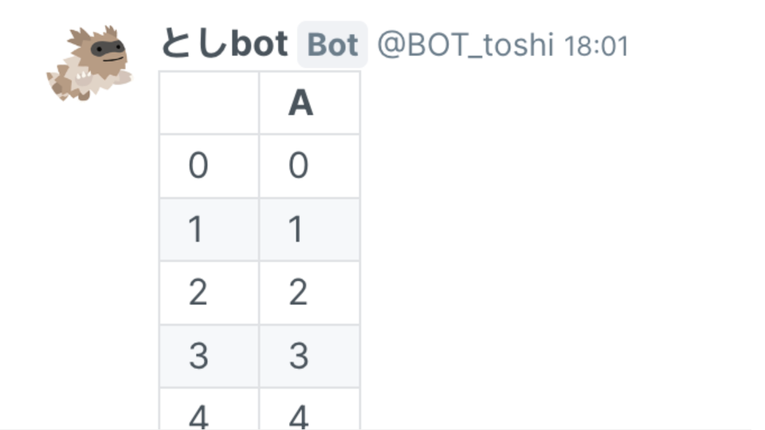

pandas の DataFrame や Series を表として traQ に送信します。

### Parameters

| Name                | Description                |
| :------------------ | :------------------------- |
| **df** (`pd.DataFrame \| pd.Series`) | 送信する表データ |
| **max_length** (`int`, optional) | 表示する最大行数（デフォルト: 10） |

### Returns

`message_id` (`str | None`): 追加したメッセージの UUID。送信に失敗した場合は `None`。

### Example

```python
from aiotraq_message import TraqMessage
import pandas as pd

async def component(am: TraqMessage):
    df = pd.DataFrame({"A": [x for x in range(30)]})
    am.dataframe(df)
```

:::border

:::
