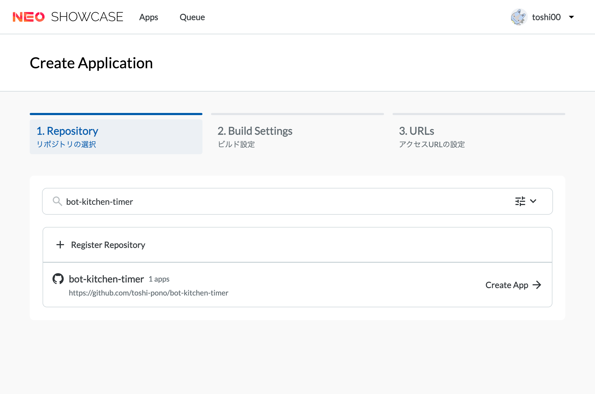

このガイドでは、`AiotraQ`を使用したアプリケーションを[NeoShowcase](https://github.com/traPtitech/NeoShowcase)にデプロイする方法を説明します。
NeoShowcaseのBuildpackを利用して、簡単にデプロイを行う手順を紹介します。

## 0. requirements.txt の作成

アプリケーションのルートディレクトリに依存関係を記述した `requirements.txt` ファイルを作成します。

#### pipの場合
```bash
pip freeze > requirements.txt
```

#### uvの場合
```bash
uv pip compile pyproject.toml > requirements.txt
```

#### poetryの場合
Poetry 2.0 以降では [poetry-plugin-export](https://github.com/python-poetry/poetry-plugin-export) を使用して `requirements.txt` を生成できます。

```bash
poetry export -f requirements.txt --output requirements.txt
```

## 1. Procfile の作成

アプリケーションのルートディレクトリに `Procfile` を作成します。
このファイルには、アプリケーションの起動コマンドを記述します。

```text
web: python main.py
```
ここで、`main.py` はアプリケーションのエントリーポイントとなるPythonファイルです。

## 2. NeoShowcaseの設定
NeoShowcaseのコンソールにアクセスし、以下の手順でアプリケーションを設定します。

### 2-1. リポジトリの選択

NeoShowcaseのコンソールで新しいアプリケーションを作成します。  
Add New Appボタンをクリックし、リポジトリを指定します。


### 2-2. ビルド設定

Application名、デプロイするブランチ、Deploy Type、Build Typeを選択します。
- Deploy Typeは`Runtime`を選択します
- Build Typeは`Buildpack`を選択します

また、データベースを使用する場合は、Use DatabaseをYesに設定し、必要なデータベースの種類を選択します。


### 2-3. アクセスURLの設定
アプリケーションのアクセスURLを設定します。
好きなサブドメインを入力してください。また、アプリケーションが待ち受けるポート番号(デフォルトでは`8080`)を指定します。


### 2-4. 環境変数の設定
必要な環境変数を設定します。Settings > Environment Variables をクリックし、必要な環境変数を追加します。  
traQ BOTをデプロイする場合、`BOT_VERIFICATION_TOKEN` と `BOT_ACCESS_TOKEN` を Bot Console から取得して設定します。

また、PYTHONPATHにアプリケーションのルートディレクトリを追加するために、環境変数を設定します。

| Key | Value |
|-----|-------|
| PYTHONPATH | /workspace/ns-repo |

:::tip
srcがアプリケーションのルートディレクトリである場合は `/workspace/ns-repo/src` を指定します。
:::

### [Optional] 2-5. BOTのアクティベーション

Start Appボタンをクリックしてアプリケーションを起動します。  
NeoShowcase上でアプリケーションが起動したことを確認したら、Bot Consoleにアクセスし、BOTをアクティベートします。  
画面左下の「アクティベーション」ボタンをクリックし、アクティベーションを行います。


BOTがイベントを受け取るには、購読イベントの設定が必要です。購読イベントタブをクリックし、必要なイベントを選択します。


