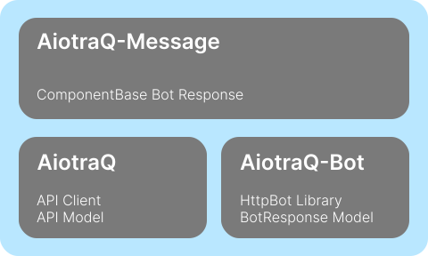

# Introduction

⚡️ AiotraQ は Python で traQ Bot を高速に開発するためのライブラリです



AiotraQ は 3 つのライブラリから構成されていて、それぞれ以下の機能を提供しています

- [aiotraq](https://github.com/toshi-pono/aiotraq/tree/main/libs/aiotraq): 非同期リクエスト対応の traQ API ラッパー
- [aiotraq-bot](https://github.com/toshi-pono/aiotraq/tree/main/libs/bot): FastAPI を使った traQ Bot ライブラリ
- [aiotraq-message](https://github.com/toshi-pono/aiotraq/tree/main/libs/message): traQ Bot のメッセージ送信ライブラリ

## インストール

Python 3.10 以上が必要です

```bash
pip install aiotraq
pip install aiotraq-bot
pip install aiotraq-message
```

## アプリケーション例

Bot がメッセージを受信したら、メッセージを返信する例

```python
import os
import asyncio
from aiotraq_bot import TraqHttpBot
from aiotraq_message import TraqMessage


async def component(am: TraqMessage, payload: str):
    am.write(payload)
    # long task
    with am.spinner():
        asyncio.sleep(3)
    am.write(":done: Done!")

bot = TraqHttpBot(verification_token=os.getenv("BOT_VERIFICATION_TOKEN"))
response = TraqMessageManager(bot, os.getenv("BOT_ACCESS_TOKEN"), "https://q.trap.jp/api/v3", "https://q.trap.jp")


@bot.event("MESSAGE_CREATED")
async def on_message_created(payload) -> None:
    channel_id = payload.message.channelId
    message = payload.message.plainText

    await response(component, channnel_id=channel_id, payload=message)

if __name__ == "__main__":
    bot.run(port=8080)
```

## API reference
