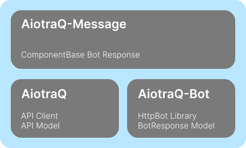

# AiotraQ-Message

streamlit 風の構文を用いてインタラクティブなメッセージ送信に対応するプラグインです。

[](https://pypi.org/project/aiotraq-message/)
[](https://github.com/toshi-pono/aiotraq/blob/main/LICENSE)
[](https://github.com/toshi-pono/aiotraq/actions/workflows/ci.yml)

## Installation

```bash
pip install aiotraq-message
```

## Requirements

AiotraQ-Message は AiotraQ に依存しています

- [AiotraQ](https://github.com/toshi-pono/aiotraq/tree/main/libs/aiotraq)
- [AiotraQ-Bot](https://github.com/toshi-pono/aiotraq/tree/main/libs/bot)



## Usage

```python
import os
import asyncio
from aiotraq_bot import TraqHttpBot
from aiotraq_message import TraqMessage

async def component(am: TraqMessage, payload: str):
    am.write("Hello, World!")
    am.write(payload)

    with am.spinner():
        # heavy task
        asyncio.sleep(3)

    am.write(":done: Done!")

bot = TraqHttpBot(verification_token=os.getenv("BOT_VERIFICATION_TOKEN"))
response = TraqMessageManager(bot, os.getenv("BOT_ACCESS_TOKEN"), "https://q.trap.jp/api/v3", "https://q.trap.jp")


@bot.event("MESSAGE_CREATED")
async def on_message_created(payload) -> None:
    channel_id = payload.message.channelId
    message = payload.message.plainText

    await response(component, channnel_id=channel_id, payload=message)

if __name__ == "__main__":
    bot.run(port=8080)
```

### Component

write, spinner, clear などのメソッドを使うことができます

- write: メッセージを送信します
- spinner: スピナーを表示します
- clear: 送信したメッセージを空にします
- clear_message: write で送信したメッセージ 1 つを削除します
- image: 画像を送信します
- pyplot: matplotlib のグラフを送信します
- dataframe: pandas の dataframe を表形式で表示します

詳細: [ドキュメント｜ Components](https://toshi-pono.github.io/aiotraq/docs/api/components/components-overview/)

## License

This project is licensed under the terms of the MIT license.
